

> 👆 click to watch demo

# Realistic Obama

Realistic Obama is a 1:1 replica of Barack Obama, the 44th President of the United States (99.4% accuracy). He was built by [Moulik Budhiraja](https://github.com/Moulik-Budhiraja), [Jeffrey Zang](https://github.com/jeffrey-zang), [Li Feng Yin](https://github.com/lifeng-yin-2), and [Daniel Zhang](https://github.com/Yourself1011) in just 34 hours for Hack the North 2025.

fun fact: our [Devpost page](https://devpost.com/software/realistic-obama) is the 4th-most liked Hack the North project ever!

# only one obama 😠

question for you: how many obamas are there in the known universe?
answer for you: only one. until today.

$$
\begin{align}
\text{before today:} \\
\text{let} \ obamas  & = 1
 \\
 \\
\text{today and onwards:} \\
\text{let} \ obamas  & \in [1, \infty]
\end{align}
$$

for too long humans have suffered with only ONE obama to be shared among the other 8,246,431,578 people. we here at Realistic Obama see this as an absolute tragedy. we live a shattered and broken society, and it's the least that we can do to bring our product to reality.

# you are my sunshine 😊

introducing Realistic Obama: the second ever obama in the known universe. it looks like obama, talks like obama, and even moves at a similarly swift pace to the real life obama. (robama or rob for short)

not only can Realistic Obama dictate any message you want it to with strikingly accurate pronounciation, it can match it with equally accurate mouth movements and even arm motions. Realistic Obama talks, listens, AND moves. just like obama.

with its wirelessly controlled movement apparatus, Realistic Obama can pull up to your location in a matter of seconds. need an urgent bedtime story? an article read to you in a calm, confident voice? Realistic Obama will be there quicker than the three blind mice.

# obamarm 💪

we 3d printed Realistic Obama's head, cutting out the jaw and the top of his head. we then hooked up his jaw and two hands to servo motors controlled with a raspberry pi.

we spent some time getting the software for quickly generating text in obama's voice working. we then take this mp3 file, measure the timestamps when obama is supposed to be speaking, and then "animated" the mouth servo to match that. we did the same with the arm servos

realistic obama has an esp32 that controls the motors for its 4 wheels. we have a wireless receiver that we connected a drone controller to that we use to control the wheels. a Lipo battery powers the esp32, motor driver, and the raspberry Pi 4 that is connected to the mouth servo through the esophagus and inside the skull. the raspberry Pi is connected to the Hack the North wifi and to the Hack the North bluetooth speaker, which is how Obama talks. the Pi holds the github repo, which has python files that call an api to generate new audio files or play existing audio files.

# obama cares ❤️

we learned that we should bring a wired mouse because i couldnt connect my wireless logitech mouse to the rpi so we kept having to borrow the mouse from this guy next to us. luckily he was very nice and let us borrow it but in the future we should bring a wired mouse if we're working with rpi

# What's next for Realistic Obama

everyone has wanted an obama at one point -> everyone deserves their very own Realistic Obama

# photo album

realistic obama at his peak
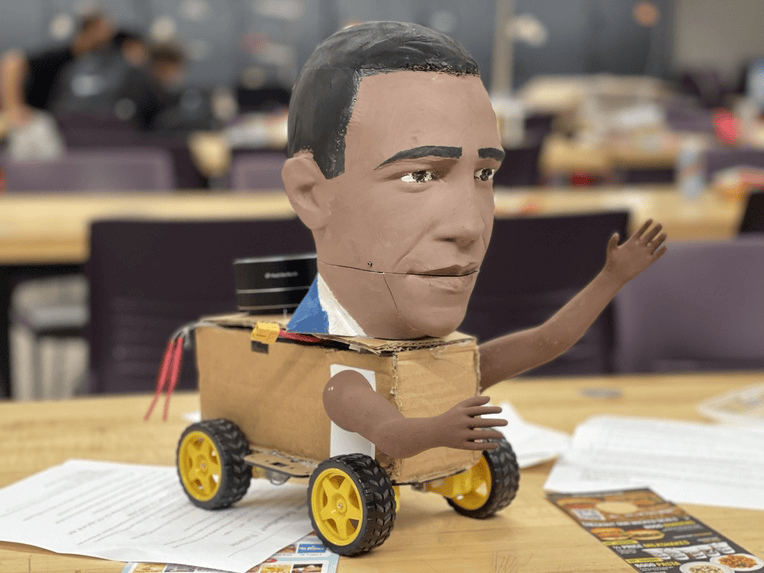

let me be clear
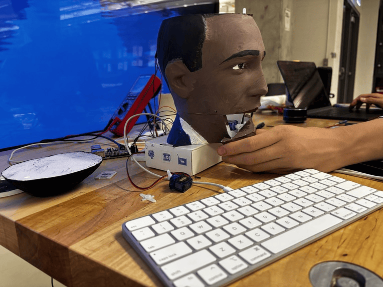

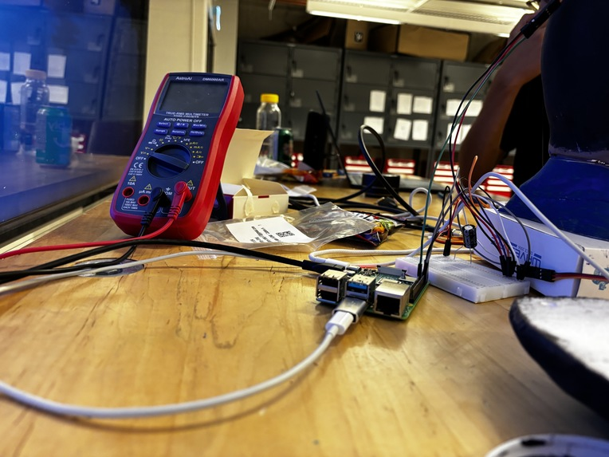
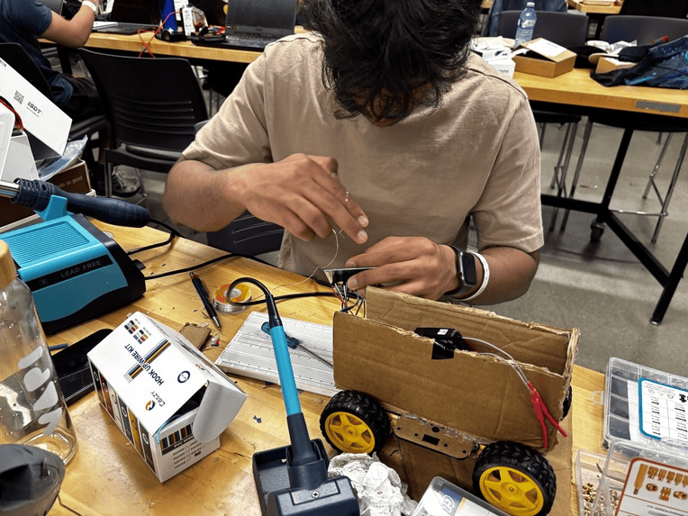
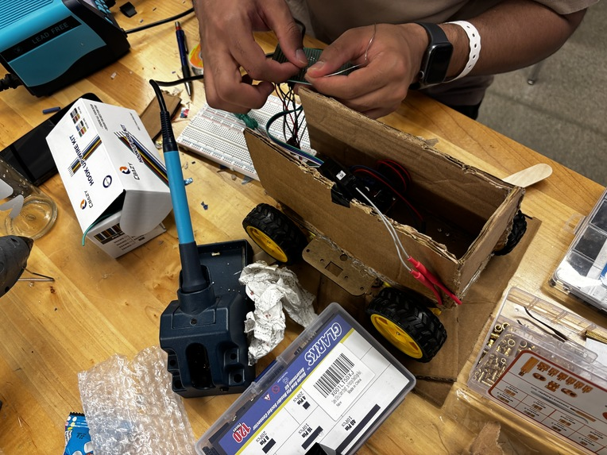
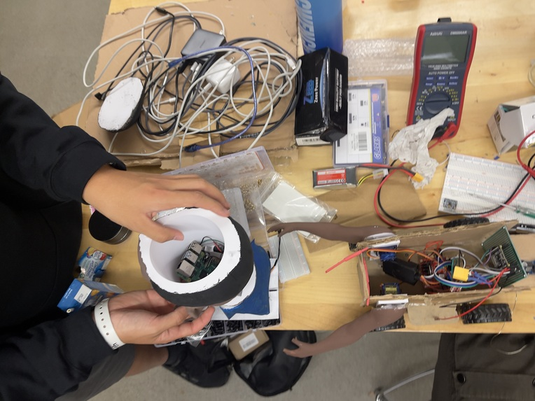
pov obama about to hug you
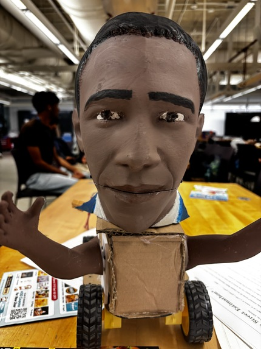
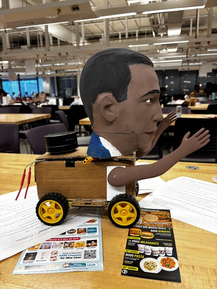

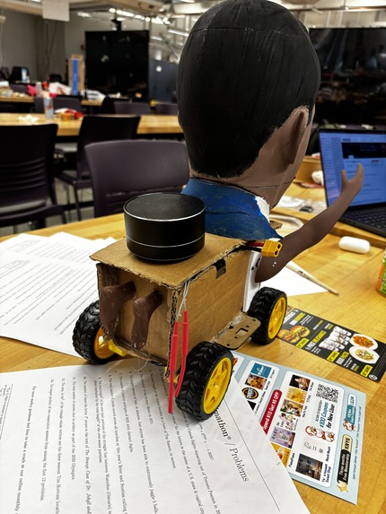
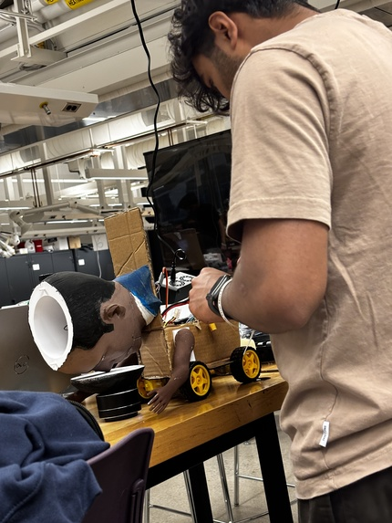
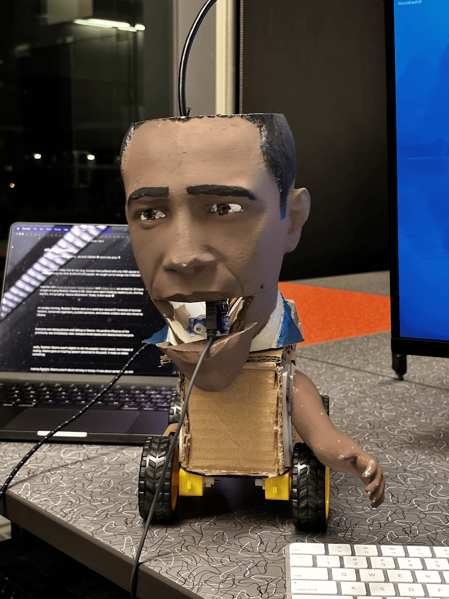
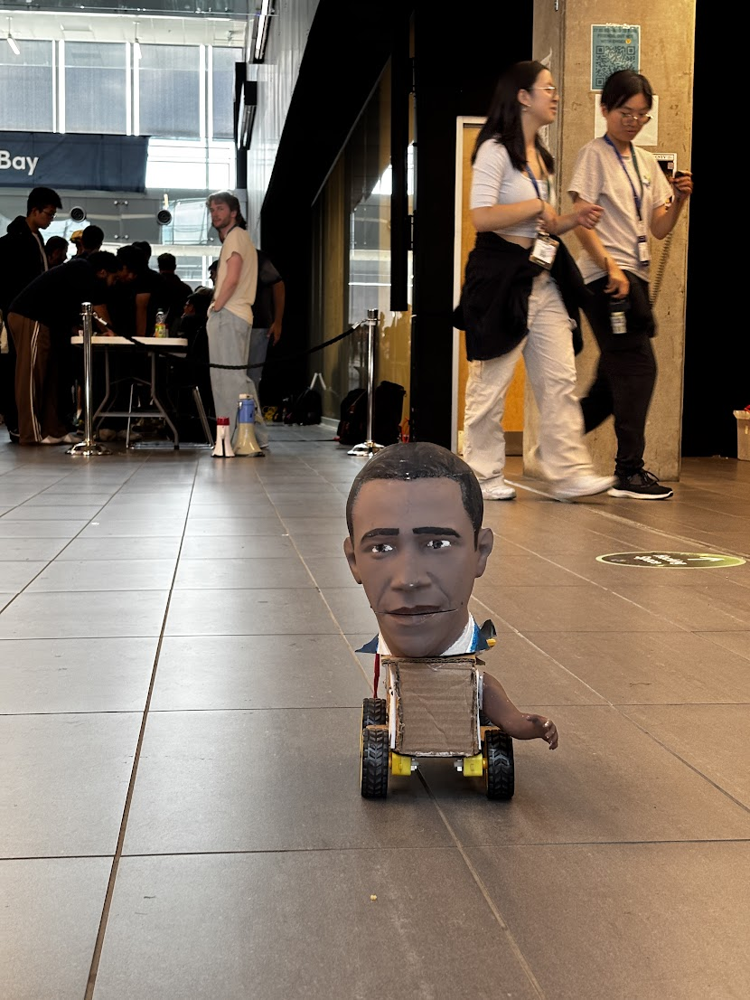
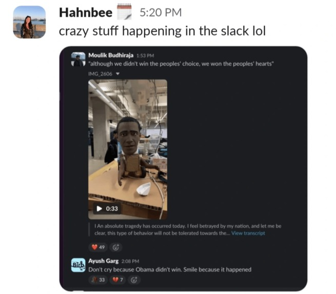

# press coverage

twitter:

- [moulik](https://x.com/moulikb_/status/1967652977801351277)
- [jeffrey](https://x.com/jefcodes/status/1967662262421950795)

linkedin:

- [daniel](https://www.linkedin.com/feed/update/urn:li:activity:7373385638718578688/)
- [jeffrey](https://www.linkedin.com/feed/update/urn:li:activity:7373419082336878592/)
- [moulik](https://www.linkedin.com/feed/update/urn:li:activity:7373385166867660801/)

youtube:

- [demo](https://youtu.be/umtdarMkHc0)
- [obama's inspirational speech to the people](https://youtube.com/shorts/Fa0FEHtGpoU?feature=share)
- [obama speaks very clearly and with conviction](https://youtu.be/mz4jaUwGGXY)

[devpost](https://devpost.com/software/realistic-obama)
